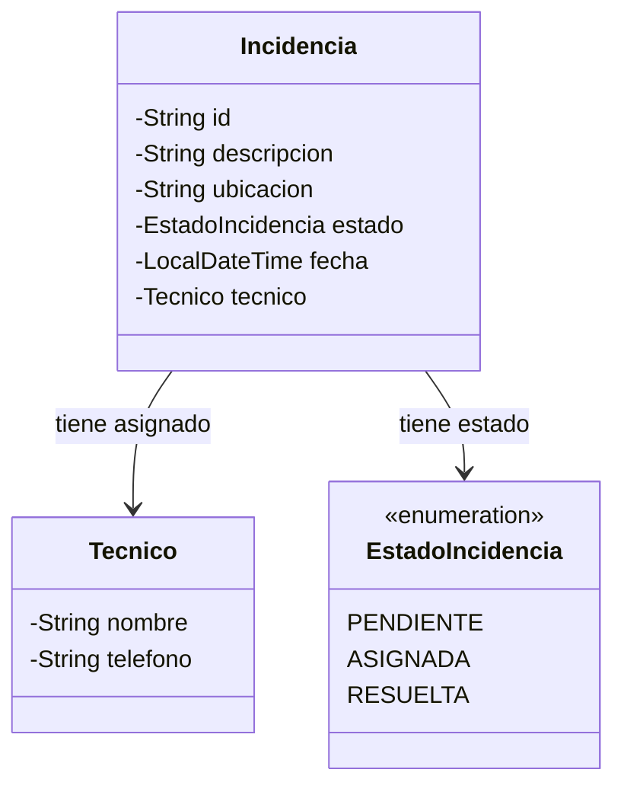
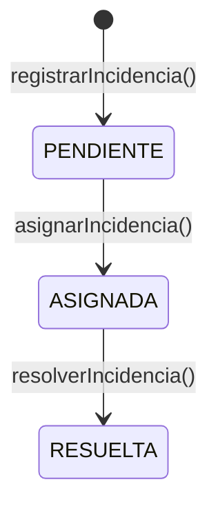

# Servicio de incidencias

Servicio REST para la gestión de incidencias desarrollado con Java EE 8 (JAX-RS + EJB) y desplegado en WildFly 20.

---

## Tecnologías

| Componente | Tecnología |
|---|---|
| Lenguaje | Java 8 |
| API REST | JAX-RS (Java EE 8) |
| Lógica de negocio | EJB Stateless |
| Persistencia | Repositorio en memoria (HashMap) |
| Servidor de aplicaciones | WildFly 20.0.1.Final |
| Construcción | Maven 3 |

---

## Modelo de dominio



### Ciclo de vida de una incidencia



---

## Estructura del proyecto

```
incidencias/
└── src/main/java/
    ├── incidencias/
    │   ├── modelo/          # Entidades: Incidencia, Tecnico, EstadoIncidencia
    │   ├── servicio/        # Interfaz IServicioIncidencias e implementación
    │   ├── repositorio/     # Implementaciones del repositorio en memoria
    │   └── rest/            # Controlador JAX-RS y DTOs
    ├── repositorio/         # Clases base del repositorio genérico
    └── utils/               # ApplicationConfig (@ApplicationPath) y Utils (UUID)
```

---

## Requisitos previos

- JDK 8 o superior
- Maven 3.6 o superior
- WildFly 20.0.1.Final

---

## Instalación y despliegue

### 1. Descargar WildFly 20

Descargar el ZIP desde:

```
https://download.jboss.org/wildfly/20.0.1.Final/wildfly-20.0.1.Final.zip
```

Descomprimir en la ruta deseada, por ejemplo:

- **Windows:** `C:\wildfly-20.0.1.Final\`
- **Linux/Mac:** `/opt/wildfly-20.0.1.Final/`

### 2. Ajustar la ruta de WildFly en el `pom.xml`

Abrir `incidencias/pom.xml` y cambiar el valor de `<jbossHome>` para que apunte al directorio donde se descomprimió WildFly:

```xml
<jbossHome>C:\wildfly-20.0.1.Final\wildfly-20.0.1.Final</jbossHome>
```

> En Linux/Mac usar barras normales, por ejemplo `/opt/wildfly-20.0.1.Final/wildfly-20.0.1.Final`.

### 3. Arrancar WildFly

```bash
# Windows
%WILDFLY_HOME%\bin\standalone.bat

# Linux/Mac
$WILDFLY_HOME/bin/standalone.sh
```

Esperar a que en la consola aparezca el mensaje:

```
WildFly Full 20.0.1.Final ... started in ...ms
```

### 4. Compilar y empaquetar

```bash
cd incidencias
mvn clean package
```

Esto genera el archivo `target/incidencias.war`.

### 5. Desplegar en WildFly

Con WildFly ya arrancado en el paso 3:

```bash
mvn wildfly:deploy
```

El artefacto queda disponible en:

```
http://localhost:8080/incidencias/
```

---

### Alternativa: arrancar y desplegar en un solo paso con `wildfly:run`

Si se prefiere no arrancar WildFly manualmente, es posible combinar los pasos 3 y 5 en un único comando. Este goal arranca WildFly (usando la ruta configurada en `<jbossHome>`), despliega la aplicación y mantiene el servidor en ejecución:

```bash
cd incidencias
mvn wildfly:run
```

> **Nota:** con `wildfly:run` el servidor permanece activo en primer plano. Para detenerlo, pulsar `Ctrl+C`.

### 6. Verificar el despliegue

```bash
curl http://localhost:8080/incidencias/api/incidencias/pendientes
```

Respuesta esperada (lista vacía inicialmente):

```json
[]
```

---

## Especificación de la API

**Base URL:** `http://localhost:8080/incidencias/api`

---

### `POST /incidencias`

Registra una nueva incidencia. La incidencia se crea en estado `PENDIENTE` con la fecha actual y un identificador UUID generado automáticamente.

**Cabeceras de la petición:**

| Cabecera | Valor |
|---|---|
| `Content-Type` | `application/json` |

**Cuerpo de la petición:**

```json
{
  "descripcion": "El proyector de la sala no enciende",
  "ubicacion": "Sala B-12"
}
```

**Respuesta `201 Created`:**

Sin cuerpo. La cabecera `Location` apunta al recurso creado:

```
Location: http://localhost:8080/incidencias/api/incidencias/a3f1e2d4-7c89-4b10-9f3e-1a2b3c4d5e6f
```

**Respuesta `400 Bad Request`** — alguno de los campos obligatorios está ausente o en blanco. El cuerpo contiene el mensaje de error:

| Situación | Mensaje |
|---|---|
| `descripcion` ausente o en blanco | `No se ha especificado ninguna descripción de la incidencia` |
| `ubicacion` ausente o en blanco | `No se ha especificado la ubicación de la incidencia` |

**Respuesta `500 Internal Server Error`** — error interno al acceder al repositorio. El cuerpo contiene el mensaje de la excepción.

---

### `PATCH /incidencias/{id}/asignar`

Asigna un técnico a una incidencia existente. El estado de la incidencia pasa de `PENDIENTE` a `ASIGNADA`.

**Parámetros de ruta:**

| Parámetro | Tipo | Descripción |
|---|---|---|
| `id` | UUID (string) | Identificador de la incidencia |

**Cabeceras de la petición:**

| Cabecera | Valor |
|---|---|
| `Content-Type` | `application/json` |

**Cuerpo de la petición:**

```json
{
  "nombreTecnico": "Ana García",
  "telefonoTecnico": "600123456"
}
```

**Respuesta `204 No Content`** — asignación realizada correctamente. Sin cuerpo.

**Respuesta `400 Bad Request`** — la petición no puede procesarse por datos inválidos o estado incorrecto de la incidencia. El cuerpo contiene el mensaje de error:

| Situación | Mensaje |
|---|---|
| `nombreTecnico` ausente o en blanco | `No se ha especificado ningún nombre del técnico` |
| `telefonoTecnico` ausente o en blanco | `No se ha especificado ningún teléfono del técnico` |
| `telefonoTecnico` no tiene exactamente 9 dígitos | `Formato del teléfono especificado inválido. Solo 9 dígitos debe ser` |
| La incidencia ya está en estado `ASIGNADA` | `La incidencia ya se encuentra asignada a un técnico` |
| La incidencia ya está en estado `RESUELTA` | `La incidencia ya se encuentra resuelta, no se puede asignar a un técnico` |

**Respuesta `404 Not Found`** — no existe ninguna incidencia con el `id` indicado.

**Respuesta `500 Internal Server Error`** — error interno al acceder al repositorio. El cuerpo contiene el mensaje de la excepción.

---

### `PATCH /incidencias/{id}/resolver`

Marca una incidencia como resuelta. El estado pasa de `ASIGNADA` a `RESUELTA`.

**Parámetros de ruta:**

| Parámetro | Tipo | Descripción |
|---|---|---|
| `id` | UUID (string) | Identificador de la incidencia |

Sin cuerpo en la petición.

**Respuesta `204 No Content`** — incidencia marcada como resuelta. Sin cuerpo.

**Respuesta `400 Bad Request`** — la incidencia no se puede resolver por su estado actual. El cuerpo contiene el mensaje de error:

| Situación | Mensaje |
|---|---|
| La incidencia está en estado `PENDIENTE` (sin técnico asignado) | `La incidencia no se encuentra asignada a ningún técnico, no se puede resolver` |
| La incidencia ya está en estado `RESUELTA` | `La incidencia ya se encuentra resuelta` |

**Respuesta `404 Not Found`** — no existe ninguna incidencia con el `id` indicado.

**Respuesta `500 Internal Server Error`** — error interno al acceder al repositorio. El cuerpo contiene el mensaje de la excepción.

---

### `GET /incidencias/pendientes`

Devuelve la lista de incidencias en estado `PENDIENTE`.

**Respuesta `200 OK`** (`application/json`):

```json
[
  {
    "resumen": {
      "id": "a3f1e2d4-7c89-4b10-9f3e-1a2b3c4d5e6f",
      "descripcion": "El proyector de la sala no enciende",
      "fecha": "2026-05-02T10:15:30"
    },
    "url": "http://localhost:8080/incidencias/api/incidencias/pendientes/a3f1e2d4-7c89-4b10-9f3e-1a2b3c4d5e6f"
  },
  {
    "resumen": {
      "id": "b7d3c5e1-2f48-4a9b-8e1d-5f6a7b8c9d0e",
      "descripcion": "Sin conexión a internet en planta 3",
      "fecha": "2026-05-02T11:00:05"
    },
    "url": "http://localhost:8080/incidencias/api/incidencias/pendientes/b7d3c5e1-2f48-4a9b-8e1d-5f6a7b8c9d0e"
  }
]
```

Si no hay incidencias pendientes, devuelve un array vacío `[]`.

**Respuesta `500 Internal Server Error`** — error interno al acceder al repositorio. El cuerpo contiene el mensaje de la excepción.
