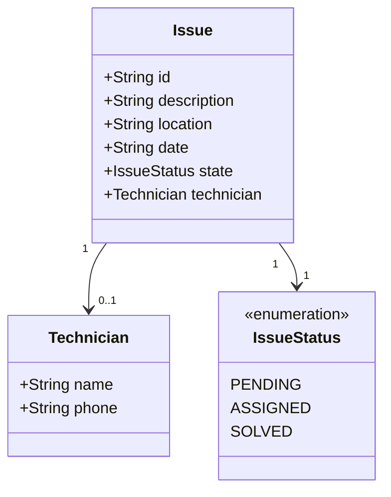

# Domain model

The platform centres on the **issue** and its lifecycle, as well as the **technician** assigned to it.

## Model Diagram

## Notes on modelling

- `Issue` is the main entity; its lifecycle is controlled by `IssueStatus`.
- `IssueStatus` is an enumeration with three values representing the valid transitions: `PENDING` → `ASSIGNED` → `SOLVED`. There are no backward transitions.
- `Technician` is a value object (it has no identity of its own).
- A `Technician` only exists when the issue is in the `ASSIGNED` or `SOLVED` state; in the `PENDING` state, it doesn't exist.