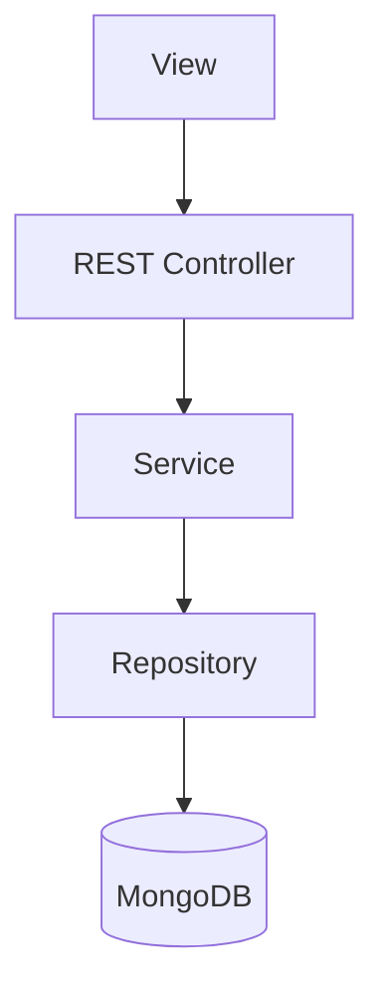

# Architecture

IncidenciApp follows a layered architecture based on the model-view separation principle. The view never accesses the model directly; all requests pass through the API (facade), which coordinates the service, the repository and the database.

- **View**: static frontend (HTML/CSS/JS) that calls the API.
- **Rest Controller**: implementation of the REST API, delegates to the service.
- **Service**: business logic.
- **Repository**: persistence in MongoDB.
- **Database**: MongoDB database.